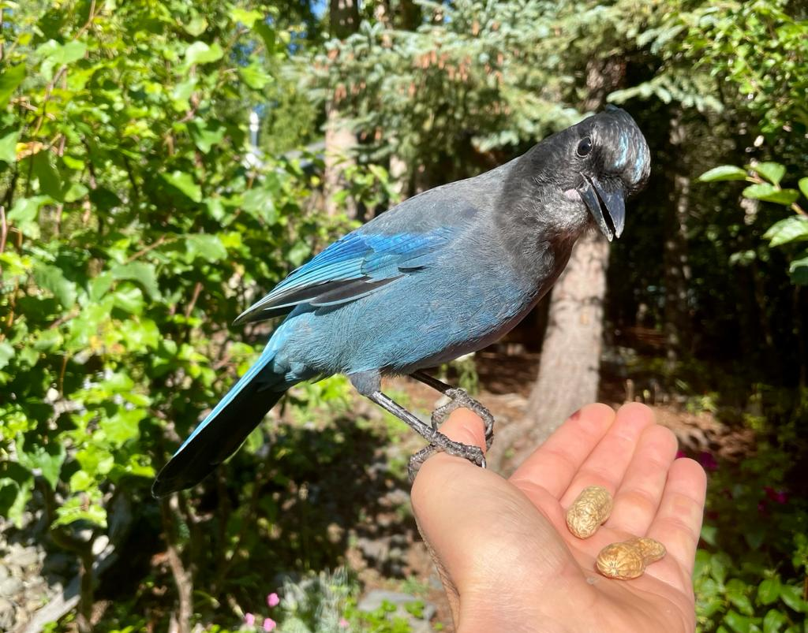

# Hello!

------------------------------------------------------------------------

I am a Biostatistics graduate student at Oregon Health and Science University, currently completing the final quarter.

I've studied at Montana State University, receiving my undergraduate degree in economics with a statistics minor in 2016. My interest in statistics and interest in public health research (most likely due to my Peace Corps stint in West Africa) led me to further my education at OHSU.

If I'm not completing my graduate degree, you can find me climbing, packrafting, or secretly being a Disney princess (see below).
    

------------------------------------------------------------------------

**Figure 1.** I convinced this bluejay to do my laundry for some peanuts

